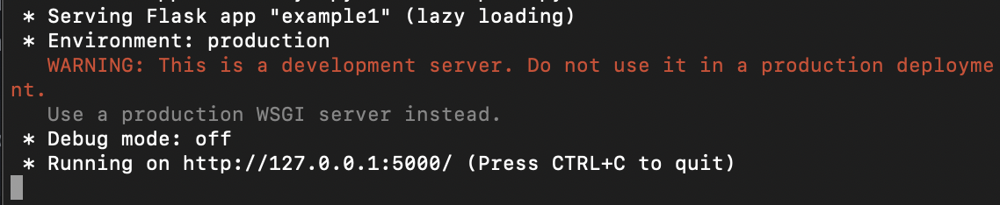
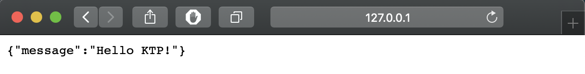
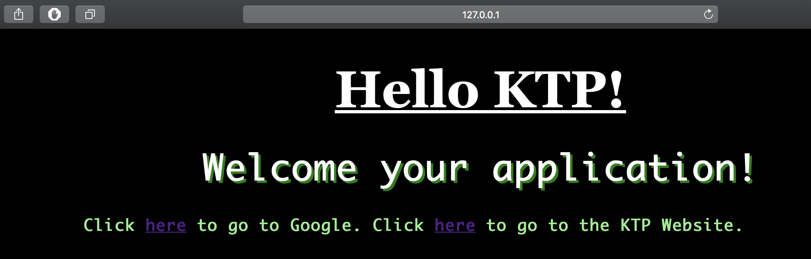

# Flask 101

## What is Flask?

Flask is a web framework written in Python that makes it really simple to build a web application. Some popular websites that include Flask in their technology stack include Netflix, Lyft, and Reddit. Flask is most commonly used to develop REST APIs (for the purposes of this tutorial, you don't really need to know that that means). It's also pretty popular in the industry and is a really useful skill to have on your resume, especially if you are interested in web development.

### What We're Going to Do

In this walkthrough, we're going to create a small application to show you just some of what you can do with Flask. The code for the app we will create is included in this repo for reference.

### Prerequisites

For this tutorial, you should have some basic familiarity with Python as well as some basic knowledge about how HTTP requests work.

## Set Up

First install `Python 3` and the latest version of `pip`, a popular Python package manager (they are most likely already installed but if not you can find instructions online). Then, create a directory where you want store your flask app and navigate to that directory. I'll call mine `app`. Once here, we need to create a virtual environment.

Let's just quickly talk about why we need virtual environments. Over time, you or apps you have installed onto your computer may have installed many different Python packages and libraries. A virtual environment is isolated from all this and acts as a fresh machine with no packages or libraries installed. This helps you keep track of what libraries and packages your specific application uses. Usually, these requirements are stored in a `requirements.txt` file that we will create later in this tutorial, so don't worry about it for now.

Use the following two lines to create and then enter the environment called myEnv:

```
$ python3 - m venv myEnv
$ source myEnv/bin/activate
```

When using GitHub, make sure to not include your virtual environment in your commits since it is technically not part of your project's codebase. Now that we are in our virtual environment, we can install Flask through pip:

```
$ pip install flask
```

If you're building an app and end up needing to install other packages or libraries, remember to activate your virtual environment before you do any installs to keep track of your dependencies.

Now we have everything we need, so we can start actually creating our application.

## Let's Build Something!

### Creating a Route

For this section, refer to the code in `example1.py`. Create a Python file in the main directory of your app. First, add the following lines to your file:

```
from flask import Flask, render_template, jsonify
app = Flask(__name__)
```

The first line imports some important functions from the Flask package, and the second line actually initializes our app. Now, we need to actually add a route so that people can access our app. Add the following code:

```
@app.route('/')
def first_route():
    return jsonify({"message": "Hello KTP!"})
```

Let's stop for a second and go over what these lines do. This code creates a URL route that we access in a browser or through an HTTP request. When this route is requested, the function `first_route` will be called. The function returns a Python dictionary that has been reformatted by the `jsonify` function as an HTTP response that includes our data so it can easily be read by a client. It's easier to see this in action. Add the following lines to your code:

```
if(__name__ == '__main__'):
    app.run()
```

Then, go to your command line, navigate to your app's directory, and run your app with the following command:

```
$ python [your app filename].py
```

This should produce the following output:



The app is now up and running. Open up a web browser and go to http://127.0.0.1:5000/. You should see:



Congratulations! You've created your first route and accessed it through a browser. This is the first step in building a larger Flask app.

### Rendering a Webpage

Now, let's try actually viewing a webpage through our Flask app. First, copy over the `templates` directory and the `static` directory from this repo and move them into the directory where you are storing the Python file you've been working in.

Add the following lines to your app file just below the first route we created (again, use `example1.py` for reference):

```
@app.route('/home')
def home_route():
    return render_template('index.html')
```

This creates a new route called `/home` that will run the `home_route` function when requested. The `render_template` function searches your app's directory for a directory called `templates`, and then looks for a file in that directory that matches the argument supplied. In this case, it looks for `index.html`. Flask then sends a formatted HTTP response that your browser can read and use to render an HTML webpage.

Let's try it. Re-run the command `python [your app filename].py` and go to http://127.0.0.1:5000/home in your browser. You should now see:



We've now created a simple website with Flask.
